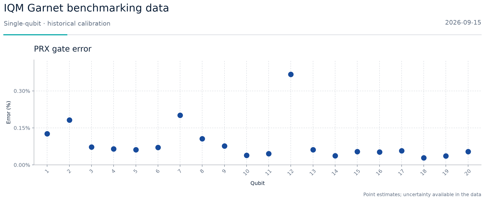
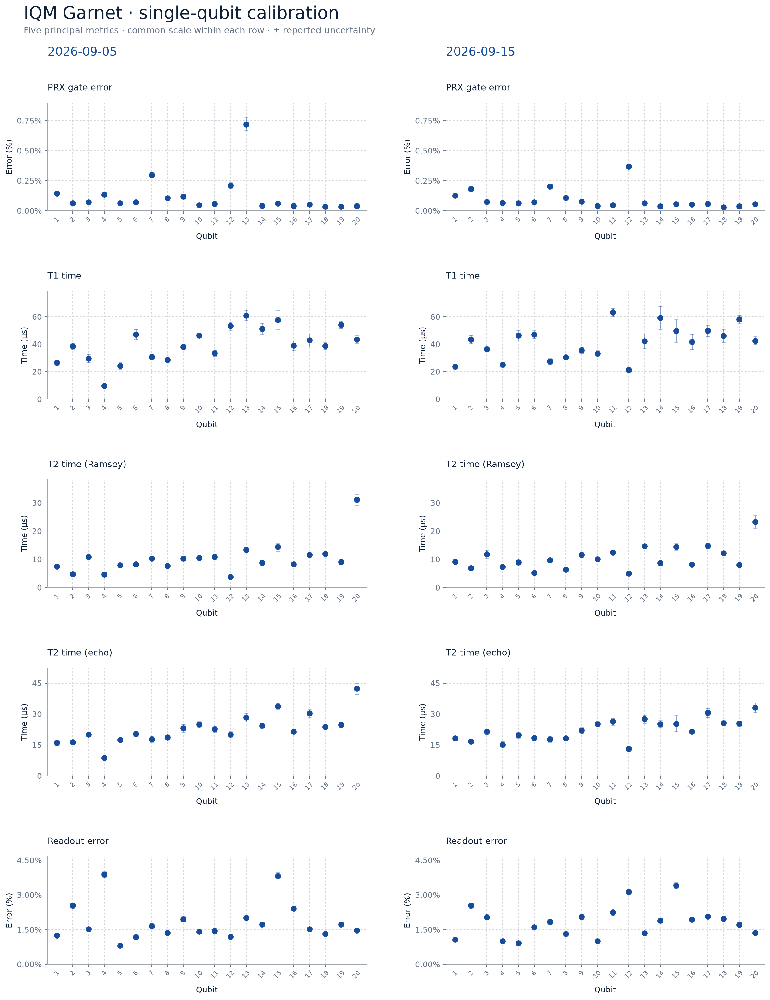

# IQM Garnet single-qubit calibration

This repository analyzes two IQM Garnet quality-metric snapshots from **5 and
15 September 2026**. It contains the original JSON files, a reproducible
Jupyter notebook, a selected machine-readable dataset, and figures. The analysis
covers 20 qubits and seven single-qubit quantities per date: **280 observations**
in total.

The metrics describe the device at the recorded calibration snapshots. They
provide context for composite-pulse experiments but do not measure the error or
robustness of a composite sequence.

[Executed notebook](garnet_single_qubit_calibration.ipynb) ·
[Offline HTML report](garnet_single_qubit_calibration.html) ·
[Selected CSV](data/garnet_single_qubit.csv) ·
[Selected JSON](data/garnet_single_qubit.json)



## Repository contents

| Path | Description |
|---|---|
| `source/` | The two original quality-metric JSON files, named by date and calibration-set ID |
| `data/garnet_single_qubit.json` | Selected observations in their source units, with source metadata and file hashes |
| `data/garnet_single_qubit.csv` | One row per date, qubit, and metric, with converted values and uncertainties |
| `data/README.md` | Data dictionary and selection rules |
| `garnet_single_qubit_calibration.ipynb` | Executed notebook with validation, plots, and optional interactive controls |
| `garnet_single_qubit_calibration.html` | Standalone, offline-readable notebook report |
| `figures/` | PNG and SVG figures plus summary statistics |
| `extract_calibration.py` | Regenerates the selected JSON and CSV from `source/` |
| `reproduce.py` | Executes the notebook and regenerates the report and figures |
| `requirements.txt` | Pinned direct dependencies, verified with Python 3.12 |

## Reproduce the analysis

From the repository directory, create a Python 3.12 environment and install
the pinned packages:

```sh
python -m venv .venv
```

Activate the environment with `.venv\Scripts\Activate.ps1` in PowerShell or
`source .venv/bin/activate` on macOS/Linux. Then run:

```sh
python -m pip install -r requirements.txt
python reproduce.py
```

`reproduce.py` checks the selected data against hashes embedded in the notebook,
executes every cell in a fresh kernel, and writes the HTML report and PNG/SVG
figures. Its analysis and rendering steps use only local files. Package
installation may require an internet connection. Figure bytes can vary across
platforms because fonts and rendering libraries differ; the source values and
transformations do not.

To rebuild the selected data from the original files in `source/`, run:

```sh
python extract_calibration.py source/2026-09-05_calibration_set_ID_81888b1e-7319-46e1-864d-9ad50ea93e94_quality_metrics.json source/2026-09-15_calibration_set_ID_bebc6c4d-7ae3-4784-8ce5-d72ea62dd621_quality_metrics.json --output-dir data
```

The notebook's expected JSON/CSV hashes are fixed for these two source files.
If the source files change, rebuild the selected data and review the notebook's
hash and coverage checks before updating them.

## What is plotted

The five main views show PRX gate error, T1, Ramsey T2, echo T2, and readout
error by qubit for both dates. The readout 0→1 and 1→0 errors appear in a
separate figure. All 20 qubits are displayed in numeric order, and the dates
have independent markers with a common vertical scale for each metric. The
notebook also offers date and metric controls in a live Jupyter session: set
`ENABLE_INTERACTIVE = True` in its setup cell.

PRX and readout errors are calculated as `100 × (1 − fidelity)` in percent.
T1 and T2 values are converted from seconds to microseconds. Source uncertainty
values are scaled by the same factor, so error uncertainties are in percentage
points and time uncertainties are in microseconds. The source files do not
specify an uncertainty confidence level or distribution.

Readout fidelity and directional errors are taken from the
`metrics.ssro.measure_fidelity.constant` family. The source files also contain
`metrics.ssro.measure.constant`; those values are a separate family and are
excluded. CZ, two-qubit Clifford, single-qubit Clifford, and QND metrics are
also excluded. The exact retained field templates are listed in the notebook
and `data/README.md`.



## Source records

| Date in filename | Calibration-set ID | Quality-metric set created (UTC) |
|---|---|---|
| 2026-09-05 | `81888b1e-7319-46e1-864d-9ad50ea93e94` | `2026-09-05T16:29:09.513375Z` |
| 2026-09-15 | `bebc6c4d-7ae3-4784-8ce5-d72ea62dd621` | `2026-09-15T02:28:16.732049Z` |

Each source file contains 360 observations; 140 single-qubit observations are
retained from each. The selected observations are all marked valid and have
reported uncertainties. The source-file SHA-256 values are recorded in both
selected data files, allowing each row to be traced to its original JSON.

The source timestamps describe quality-metric records. An experiment's job
metadata is needed to establish which calibration set applied to a particular
run. Two snapshots alone do not establish continuous device stability or a
trend between the dates.
